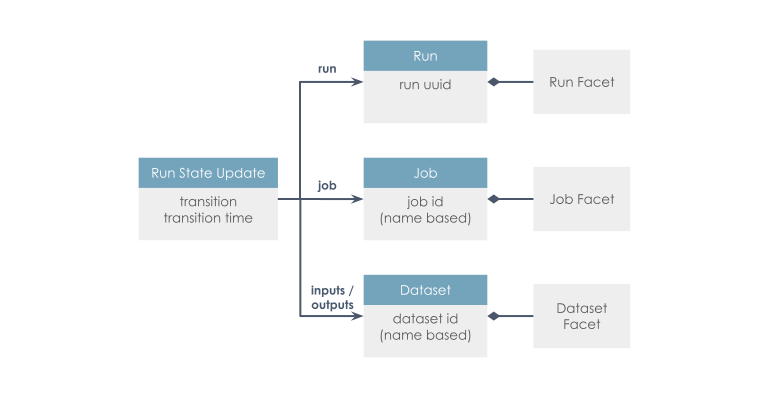

# brightway-data-lineage

## What is data lineage?
Data lineage is the process of tracking data over time, recording its origin, how it has changed, and its final destination within the data pipeline. One can implement data lineage through any of the following approaches:
- Pattern-based lineage: evaluates metadata without consideringthe code used to generate data and detects instances of data by assessing their similarity
- Data tagging: data is tagged by a transformation engine, suited for cloed systems
- Self-contained: data lakes can inherently provide lineage, although they are closed systems
- Parsing: logic used to process data is read automatically, but complex to deploy

[Openlineage](https://openlineage.io/) provides an open standard for data lineage collection and analysis. It tracks metadata about datasets, jobs, and runs, using a consistent naming strategy. The core lineage model is extensible by defining specific facets to enrich those entities. 

In this package, we use openlineage's python client, which uses the self-contained approach, to add function-logging capabilities to [brightway](https://github.com/brightway-lca/brightway25).

## Data lineage in the context of LCA
LCA data comes from various sources and gets changed around along the way, and might influence results in not-so-clear ways. It would therefore be useful to know where each piece of data comes from, what it has undergone and be able to reproduce projects with certainty and ease. Data lineage essentially let's us keep track of the lide cycle of our life cycle data!

## Use cases of this package

|id        | As                   | I want to                                                 | So that                                          |       |
| :---:    |  :---:               |  :---:                                                    |  :---:                                           |  :---:|
| 01       | user of Brightway    | trace back shared projects                                | I can reproduce them easily                      |       |
| 02       | user of Brightway    | keep track of database changes & versions                 | make informed decisions                          |       |
| 03       | ......               | .....                                                     | ......                                           |       |
| 04       | ....                 | ........                                                  | .........                                        |       |
